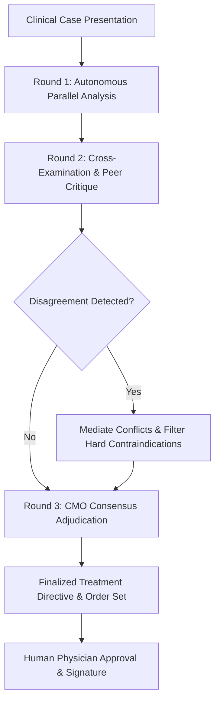

# MediAssist Multi-Agent Clinical Council & Consensus Engine

The **Agent Council** microservice transforms solitary LLM medical inference into a structured, peer-reviewed **Multi-Disciplinary Team (MDT)** deliberation inspired by hospital tumor boards and critical care consensus rounds.

---

## 🔬 Agent Personas & Specializations

1. **Lead Diagnostician (`Dr. Alex Rivera, MD`)**:
   - Synthesizes presenting symptoms, vital trajectories, and laboratory biomarkers.
   - Formulates prioritized differential diagnoses with ICD-10 codification.

2. **Clinical Pharmacotherapy Specialist (`Dr. Priya Patel, PharmD`)**:
   - Audits proposed pharmacotherapy for drug-drug interactions, contraindications, and organ clearances (e.g. eGFR dosing).
   - Flags adverse drug events, QT prolongation risks, and documented allergy cross-reactivities.

3. **Diagnostic Radiologist (`Dr. Marcus Vance, MD`)**:
   - Evaluates anatomical imaging modalities (CXR, CT, MRI) and correlates with clinical findings.

4. **Infectious Disease & Stewardship Lead (`Dr. Elena Rostova, MD`)**:
   - Enforces hospital antibiotic stewardship protocols and sepsis 1-hour bundle guidelines.

5. **Chief Medical Officer Adjudicator (`CMO Council`)**:
   - Evaluates inter-agent disagreements, applies evidence-based clinical guidelines, and issues finalized adjudicated care protocols.

---

## 🔄 Multi-Round Deliberation Graph

---

## 🚀 API Endpoints

- `POST /api/v1/council/debate`: Execute full 3-round deliberation on a clinical case.
- `GET /api/v1/council/agents`: Get active council agents and specialties.
- `GET /api/v1/council/cases`: Get sample clinical cases.
- `GET /api/v1/health`: Health status probe.
