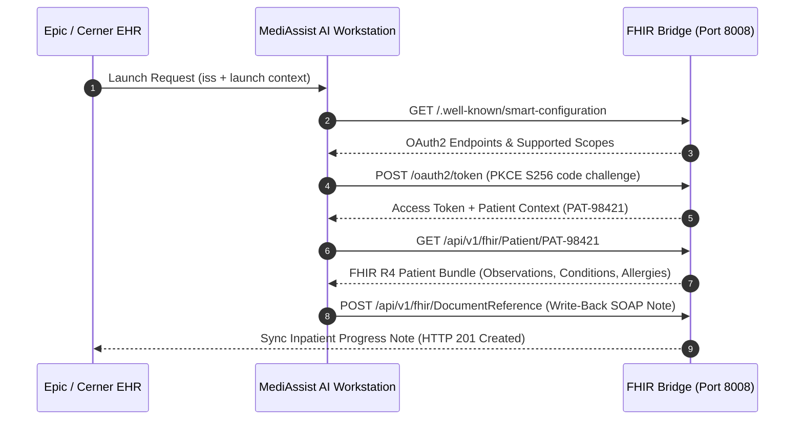

# MediAssist SMART on FHIR R4 Bridge & EHR Synchronization Gateway

The **FHIR Bridge** microservice provides full compliance with the **SMART App Launch Framework (v2.0.0)** and **HL7 FHIR Release 4 (v4.0.1)** for bidirectional synchronization with Epic Hyperspace and Oracle Cerner Millennium EHRs.

---

## ⚡ SMART on FHIR Architecture

---

## 🔬 Supported HL7 FHIR R4 Resources

1. **`Patient`**: Demographics, MRN identifiers, telecoms.
2. **`Observation`**: LOINC-coded vital signs and laboratory results (`2571-8` Lactate, `2160-0` Creatinine, `8867-4` Heart Rate).
3. **`Condition`**: ICD-10-CM encounter diagnoses and SNOMED CT problem lists (`R65.20` Sepsis, `N17.9` AKI).
4. **`AllergyIntolerance`**: Criticality rankings and reaction manifestations (`373270004` Penicillin Anaphylaxis).
5. **`DocumentReference`**: Clinical progress notes and assessment/plans (`LOINC 11506-3`).
6. **`MedicationRequest`**: RxNorm-coded inpatient medication orders with renal dosing parameters.

---

## 🚀 API Endpoints

- `GET /.well-known/smart-configuration`: SMART discovery metadata.
- `POST /oauth2/token`: Token exchange simulator with PKCE verification.
- `GET /api/v1/fhir/Patient/{id}`: Full FHIR R4 patient bundle.
- `POST /api/v1/fhir/DocumentReference`: Write-back clinical note.
- `POST /api/v1/fhir/MedicationRequest`: Write-back prescription order.
- `GET /api/v1/fhir/sync/audit-logs`: Transaction audit history.
